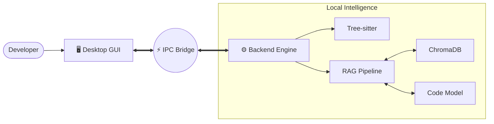

# LegacyLift
### *From Legacy Chaos to Modern Mastery.*
<br>

<div align="center">


**An Enterprise-Grade, Offline-First Modernization Studio for Legacy Codebases.**

[Features](#-features) • [Architecture](#-architecture) • [AI Engine](#-intelligence-engine) • [Installation](#-quick-start)

</div>

---

## The Problem
**220 Billion lines of COBOL** run the world's banks. **95% of ATM transactions** rely on code written before the moon landing. Developers are retiring, documentation is lost, and rewriting is "too risky."

## The Solution: LegacyLift
LegacyLift is not just another AI chat wrapper. It is a **full-scale desktop studio** that brings:
1.  **Deterministic Accuracy:** Tree-sitter parsing for exact syntax analysis.
2.  **AI Reasoning:** Custom Code Models to understand *intent* and *business logic*.
3.  **Total Privacy:** Your code **NEVER** leaves your machine.

---

## Features

### 1. Multi-Language Intelligence
We don't just "read" code; we build **Abstract Syntax Trees (AST)** for:
*   COBOL (IBM/Gnu)
*   Python (2.x & 3.x)
*   Java (6 to 21)
*   JavaScript / TypeScript
*   *...and more via Tree-sitter*

### 2. Hybrid Analysis Engine
Stop choosing between "dumb" static analysis and "hallucinating" AI. We use both.
*   **Fact Extraction:** Imports, dependencies, complexity scores (Deterministic).
*   **Logic Extraction:** "This function locks the account after 3 failed tries" (AI).

### 3. Security First
*   **CVE Scanning:** Maps dependencies to the OSV.dev vulnerability database.
*   **Pattern Matching:** Instantly flags hardcoded keys, MD5/SHA1 usage, and SQLi risks.
*   **Offline by Default:** No cloud connection required.

### 4. The "Lift" Porting Studio
Don't just view code—modernize it.
*   **Side-by-Side Diffs:** See the legacy code and the AI-suggested modern version.
*   **One-Click Port:** Convert `urllib2` to `requests` or `MySQLdb` to `mysql-connector` instantly.

---

## Architecture

LegacyLift assumes nothing about your environment. It runs as a **self-contained desktop application**.



**Technology Stack:**
*   **Frontend:** Electron, React 18, Monaco Editor (VS Code engine).
*   **Backend:** Python 3.11+, Tree-sitter, Pydantic.
*   **Data:** ChromaDB (Vector Store), JSON (Config).
*   **AI:** Local Inference Engine (custom fine-tuned models).

---

## Intelligence Engine

We use a **Retrieval-Augmented Generation (RAG)** pipeline optimized for code.

1.  **Chunking:** Code is split by *function* and *class* (semantic), not just lines.
2.  **Embedding:** High-performance embeddings map code to mathematical vectors.
3.  **Retrieval:** When you ask "Where is the auth logic?", we find the exact 5 functions responsible, even in a 100k line codebase.

---

## Quick Start
### Prerequisites
*   **OS:** Windows 10/11 (desktop app is tested and packaged for Windows)
*   **Node.js:** 20.x LTS
*   **Python:** 3.11.x
*   16GB RAM recommended
*   (Optional) NVIDIA GPU for faster local inference

### Workspace Layout
The project is organized as:

*   `electron/` – Electron main process and preload scripts (desktop shell)
*   `src/` – React 18 renderer app (LegacyLift UI)
*   `legacylift/` – Python 3.11+ backend (FastAPI API, analyzers, RAG, LLM abstraction)
*   `tests/` – Backend integration tests and future unit tests
*   `dist/` – Built frontend assets consumed by Electron in production

### Installation (Development)
```bash
# Installation Guide

## 1. Clone the repository

```bash
git clone https://github.com/yourusername/LegacyLift.git
cd LegacyLift
```

---

# 2. Set up Python 3.11 Environment

### Windows (PowerShell)

```powershell
py -3.11 -m venv .venv
.venv\Scripts\Activate.ps1
pip install -r requirements.txt
```

### Linux / macOS

```bash
python3.11 -m venv .venv
source .venv/bin/activate
pip install -r requirements.txt
```

---

# 3. Install Node.js Dependencies

Make sure **Node.js 20.x LTS** is installed.

Download from:  
https://nodejs.org

Then install dependencies:

```bash
npm install
```

---

# 4. Install and Configure LM Studio (Local AI Models)

LegacyLift uses **LM Studio** to run AI models locally for code explanation and analysis.

### Step 1: Download LM Studio

Download from:  
https://lmstudio.ai

Install it like a normal application.

---

### Step 2: Download an AI Model

Open **LM Studio → Models → Download**

Recommended models:

• `Llama 3 Instruct`  
• `DeepSeek Coder`  
• `Code Llama`  

For most systems:

- **7B or 8B models** work well
- With **32GB RAM** you can run **13B models**

Example recommended model:

```
deepseek-coder-6.7b-instruct
```

---

### Step 3: Load the Model

In LM Studio:

1. Go to **Local Server**
2. Select the downloaded model
3. Click **Load Model**

---

### Step 4: Start the Local API Server

Enable the **OpenAI-compatible server** in LM Studio.

Default settings:

```
Server Address: http://localhost:1234
API Format: OpenAI Compatible
```

Start the server.

If successful you should see:

```
HTTP server listening on port 1234
```

---

### Step 5: Configure LegacyLift to Use LM Studio

In your backend configuration, set the API endpoint:

```
http://localhost:1234/v1/chat/completions
```

Example environment variable:

```
LLM_ENDPOINT=http://localhost:1234/v1
```

LegacyLift will now send code snippets to LM Studio for:

- Code explanation
- Business logic extraction
- Risk detection
- Refactoring suggestions

All processing happens **locally on your machine**.

---

# 5. Launch Development Mode (Electron + FastAPI Backend)

Start the full desktop application:

```bash
npm run electron:dev
```

This will launch:

- Electron Desktop UI
- React Frontend
- Python FastAPI Backend

---

# 6. Run Backend Tests (Optional)

```powershell
py -3.11 -m venv .venv
.venv\Scripts\Activate.ps1
python tests/test_phase1.py
```

---

# System Requirements

Minimum:

- 16GB RAM
- Python 3.11
- Node.js 20 LTS
- 10GB free disk space

Recommended:

- 32GB RAM
- GPU acceleration (optional)
- NVMe SSD
- 13B parameter LLM

---

# Offline Mode

LegacyLift supports **fully offline execution**.

Requirements:

- Local LLM through **LM Studio**
- No cloud services required
- Ideal for **enterprise environments handling sensitive codebases**

---

# Optional Cloud Integration

LegacyLift can optionally integrate with AWS services:

- **AWS Bedrock** – AI model inference
- **AWS Lambda** – serverless compute
- **AWS S3** – storing analysis reports
- **CloudWatch** – monitoring
- **IAM** – authentication and access control
```

---

## AI Modes: Offline & Cloud

LegacyLift supports both **offline** and **cloud** AI:

- **Offline (local)**: Uses **Ollama** or **LM Studio** running on your machine.
  - Configure in the **Settings → Local AI** tab (Ollama/LM Studio URL and model name).
  - Select **Local** in the top bar toggle.
- **Cloud (AWS Bedrock)**: Uses AWS Bedrock foundations models (e.g. Claude 3 Haiku).
  - Configure in the **Settings → Cloud AI** tab (AWS keys, region, Bedrock model ID).
  - Select **Cloud** in the top bar toggle.

The desktop app persists these choices in `~/.legacylift/config.json` and the backend respects the selected mode for `/explain` and other AI-powered features. If the selected provider is unreachable, API calls will return a clear error and the UI surfaces it in the **Settings** and **Logs** panels.

---

## Security & Privacy
LegacyLift is **Private by Design**. 
*   **Zero Telemetry:** We don't track your code.
*   **Local Inference:** All AI processing happens on your hardware.
*   **Optional Cloud:** Connect to AWS Bedrock *only if you explicitly enable it*.

---

<div align="center">
  <br>
  <sub>Built for the AI for Bharat Hackathon 🇮🇳</sub>
  <br>
  <sub>Team N9022</sub>
</div>
