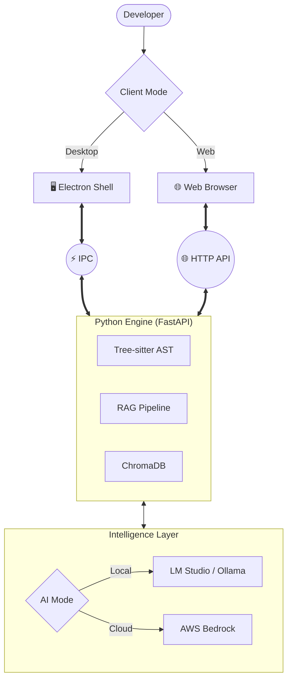

# LegacyLift
### *From Legacy Chaos to Modern Mastery.*
<br>

<div align="center">


**An Enterprise-Grade, Offline-First Modernization Studio for Legacy Codebases.**

[Features](#-features) • [Architecture](#-architecture) • [Deployment](#-deployment) • [Quick Start](#-quick-start)

</div>

---

## The Problem
**220 Billion lines of COBOL** run the world's banks. **95% of ATM transactions** rely on code written before the moon landing. Developers are retiring, documentation is lost, and rewriting is "too risky."

## The Solution: LegacyLift
LegacyLift is not just another AI chat wrapper. It is a **full-scale modernization studio** that brings:
1.  **Deterministic Accuracy:** Tree-sitter parsing for exact syntax analysis.
2.  **AI Reasoning:** Custom Code Models to understand *intent* and *business logic*.
3.  **Total Privacy:** Flexible deployment (Local-Only or Private VPC) ensures your code **NEVER** leaves your authorized environment.

---

## Features

### 1. Multi-Language Intelligence
We build **Abstract Syntax Trees (AST)** for high-fidelity analysis:
*   COBOL (IBM/Gnu)
*   Python (2.x & 3.x)
*   Java (6 to 21)
*   JavaScript / TypeScript
*   *...and more via Tree-sitter*

### 2. Hybrid Analysis Engine
Combines deterministic facts with LLM reasoning.
*   **Fact Extraction:** Imports, dependencies, complexity scores (Deterministic).
*   **Logic Extraction:** Translates cryptic code into human-readable intent (AI).

### 3. Enterprise Governance
*   **CVE Scanning:** Maps dependencies to the OSV.dev vulnerability database.
*   **Pattern Matching:** Flags hardcoded keys, MD5/SHA1 usage, and security risks.
*   **Health Scoring:** Overall migration readiness index for legacy programs.

---

## Architecture

LegacyLift is designed to be highly portable, running as either a **Standalone Desktop App** or a **Private Web Service**.



---

## Deployment Modes

### 1. Standalone Desktop (Electron)
The primary mode for individual developers or high-security stations.
*   **Stack:** Electron 30+, React 18, Python 3.11+.
*   **Privacy:** 100% offline-compatible when paired with a local LLM runner.
*   **Control:** Direct filesystem access for local projects.

### 2. Private Web Service (AWS EC2)
Ideal for team access or centralized modernization.
*   **Stack:** Ubuntu 22.04 LTS, FastAPI, Vite (Static Build).
*   **Hosting:** Deployable on a single EC2 instance using a unified serving model.
*   **Scalability:** Leverages AWS Bedrock (Claude 3) for enterprise-scale analysis.

---

## Quick Start (Development)

### Prerequisites
*   **Node.js:** 20.x LTS
*   **Python:** 3.11.x
*   **RAM:** 16GB (32GB+ recommended for local LLM)

### Installation
```bash
# 1. Clone & Install
git clone https://github.com/yourusername/LegacyLift.git
cd LegacyLift
npm install

# 2. Setup Python environment
# Windows:
py -3.11 -m venv .venv
.venv\Scripts\Activate.ps1
pip install -r requirements.txt

# Linux/macOS:
python3.11 -m venv .venv
source .venv/bin/activate
pip install -r requirements.txt
```

### Running Locally (Desktop Mode)
```bash
npm run electron:dev
```

---

## Local AI Setup (LM Studio / Ollama)

LegacyLift can use local AI models to ensure your code never hits the internet.

1.  **Download LM Studio:** [lmstudio.ai](https://lmstudio.ai)
2.  **Download a Model:** Recommended: `deepseek-coder-6.7b-instruct` or `CodeLlama-13B`.
3.  **Start Server:** Enable the "OpenAI-compatible server" in LM Studio (typically port `1234`).
4.  **Configure:** In LegacyLift Settings, set the Local Endpoint to `http://localhost:1234/v1`.

---

## Web Deployment (AWS EC2)

To host LegacyLift as a private web service for your team:

1.  **Build Frontend:**
    ```bash
    npm run build
    ```
    This generates a `dist/` folder.
2.  **Deploy to EC2:**
    Sync the `legacylift/` engine and the `dist/` folder to your instance.
3.  **Launch Server:**
    ```bash
    python -m legacylift.cli serve
    ```
    The FastAPI backend will automatically detect the `dist/` folder and serve the web UI alongside the API.
4.  **Security:** Ensure the instance has an **IAM Role** with `AmazonBedrockFullAccess` if using Cloud AI.

---

<div align="center">
  <br>
  <sub>Built for the AI for Bharat Hackathon 🇮🇳</sub>
  <br>
  <sub>Team N9022</sub>
</div>
