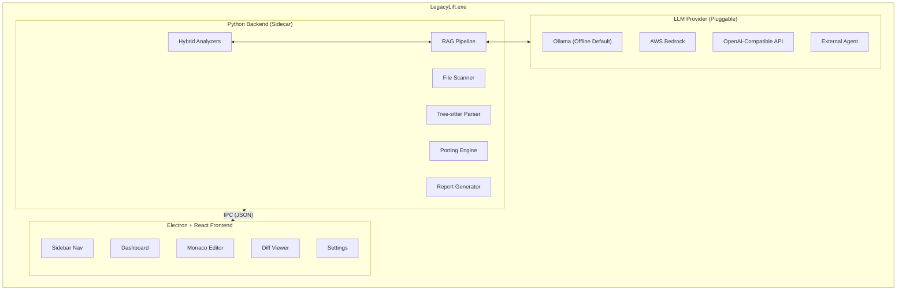
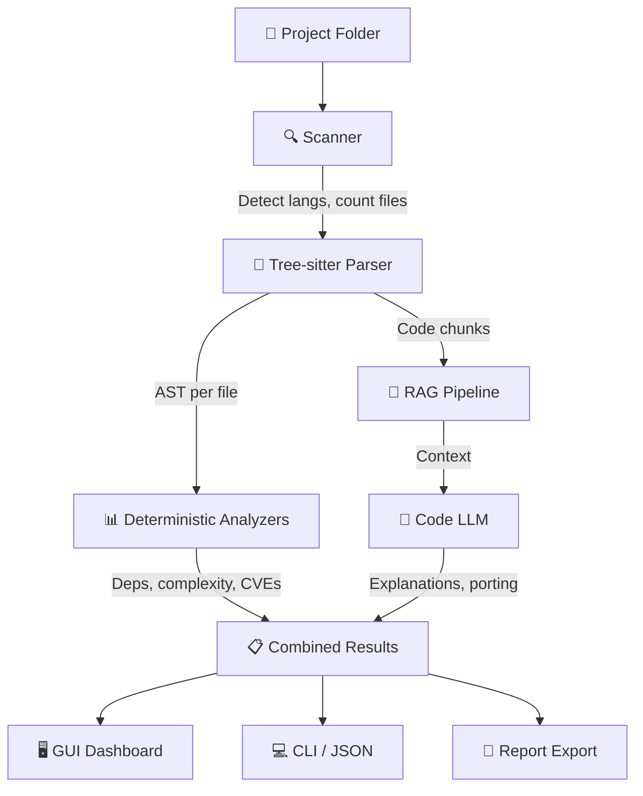
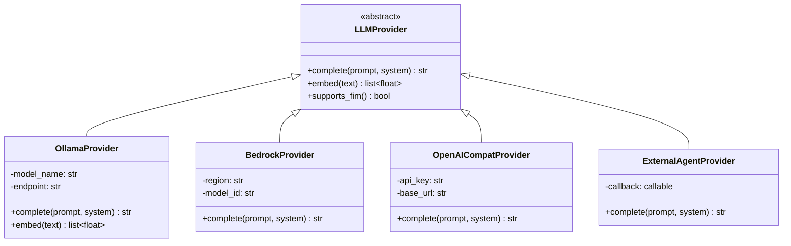
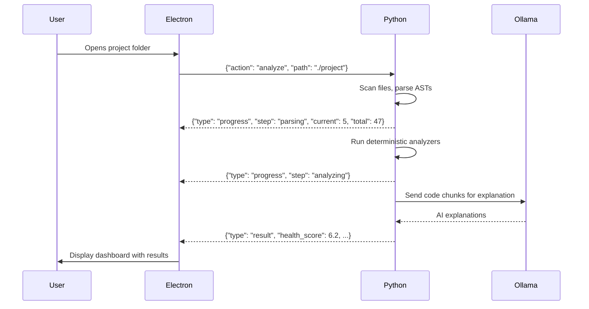
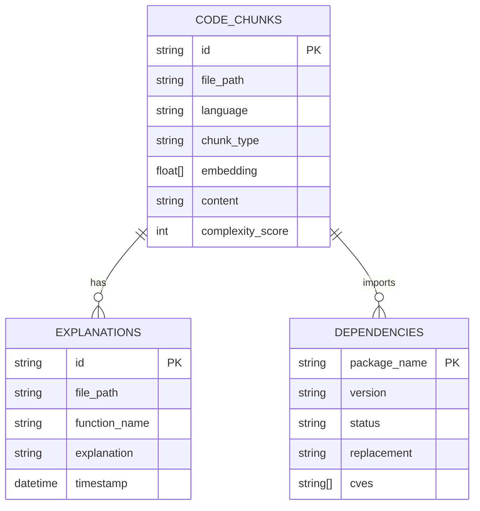
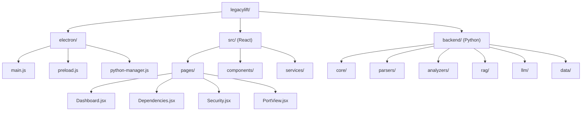
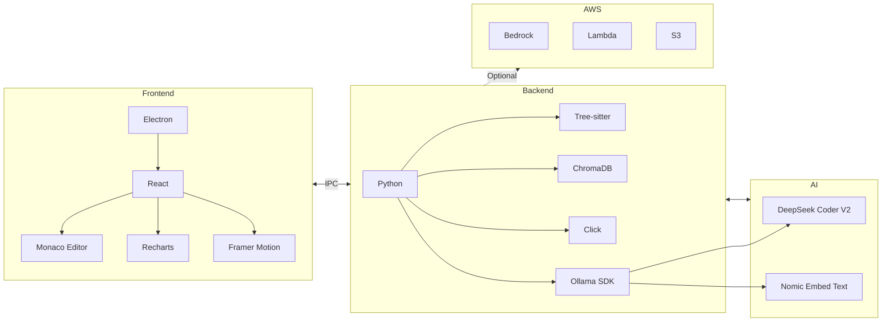
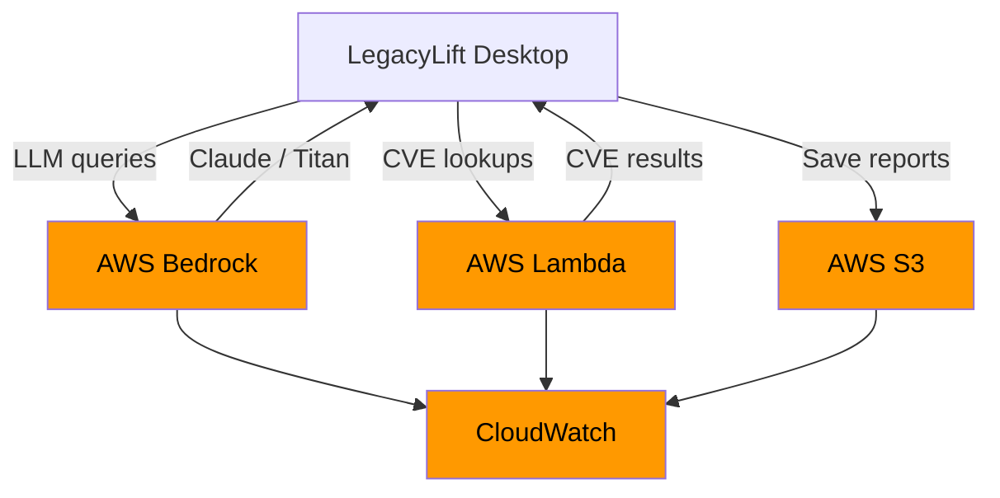

# LegacyLift - Design Document

## System Architecture

## Data Flow

## Component Design

### Pluggable LLM Interface

### Analysis Pipeline

```mermaid
flowchart LR
    subgraph Layer1 ["Layer 1: PARSE"]
        TS["Tree-sitter Engine"]
    end

    subgraph Layer2 ["Layer 2: UNDERSTAND"]
        DET1["Dependency Extractor"]
        DET2["Complexity Calculator"]
        AI1["AI Code Explainer"]
        AI2["Business Logic Extractor"]
    end

    subgraph Layer3 ["Layer 3: DIAGNOSE"]
        DET3["CVE Scanner"]
        DET4["Security Patterns"]
        AI3["AI Threat Analyzer"]
    end

    subgraph Layer4 ["Layer 4: PRESCRIBE"]
        AI4["Porting Engine"]
        AI5["Alternative Finder"]
    end

    subgraph Layer5 ["Layer 5: REPORT"]
        RPT["Report Generator"]
        DASH["Dashboard HTML"]
    end

    Layer1 --> Layer2 --> Layer3 --> Layer4 --> Layer5
```

### IPC Protocol (Frontend ↔ Backend)

## Database Design

### Vector Store (ChromaDB)

### Static Knowledge Base

| File | Content | Format |
|------|---------|--------|
| `package_mappings.json` | 500+ old→new package mappings | `{"urllib2": {"replacement": "requests"}}` |
| `security_patterns.json` | Regex for vulnerabilities | `{"md5_hash": {"severity": "critical"}}` |
| `migration_rules.json` | Language upgrade rules | `{"python2to3": {"print_stmt": "..."}}` |

## Project Structure

## Technology Stack

## AWS Integration

## Security Considerations

- All code analysis runs locally by default (privacy-first)
- No data transmitted to cloud unless user explicitly enables AWS mode
- LLM inputs sanitized to remove discovered credentials
- API keys stored in local encrypted config, never in source
